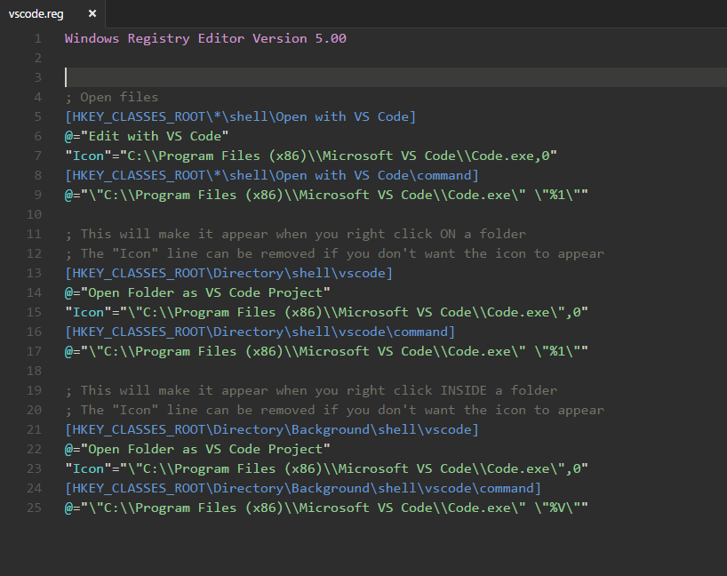
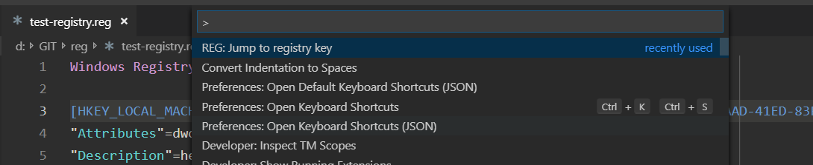

# REG for Visual Studio Code

Windows Registry Script (.reg) Language package for Visual Studio Code





## Installation
You can install it from the [marketplace](https://marketplace.visualstudio.com/items?itemName=ionutvmi.reg).
`ext install reg`

## Commands
- extension.reg.jumpToKey - jumps to the specified registry key  
    The key is identified by the text inside the square brackets `[...]` on the current line.

## Setting up key binding
```
    {
        "key": "ctrl+shift+alt+j",
        "command": "extension.reg.jumpToKey"
    }
```

## Author
Mihai Ionut Vilcu
 
+ [github/ionutvmi](https://github.com/ionutvmi)
+ [twitter/ionutvmi](http://twitter.com/ionutvmi)

